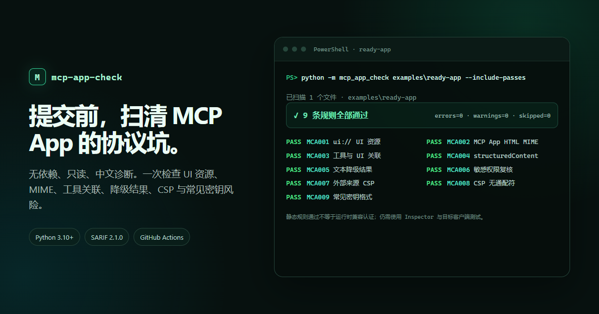

# mcp-app-check

[](https://github.com/Uky0Yang/mcp-app-check/actions/workflows/ci.yml)
[](https://www.python.org/)
[](LICENSE)

用一个无依赖、只读的 CLI，在提交前检查 MCP Apps 项目的协议就绪度和常见安全问题。

它适合正在开发 MCP Apps 的个人开发者、MCP server 维护者和需要在 CI 中设置最低质量门槛的团队。工具扫描 TypeScript、JavaScript、Python、HTML 等源码，不启动服务器、不执行项目代码，也不发起网络请求。

> English summary: a dependency-free static readiness and security checker for vendor-neutral MCP Apps projects, with CI-friendly JSON output and actionable Chinese diagnostics.



## 实测演示

仓库内的 `examples/ready-app` 是一个最小、可扫描的 MCP App server 示例。下面这条命令会读取其源码并显示全部规则结果，不会安装依赖或执行示例代码：

```powershell
python -m mcp_app_check examples\ready-app --include-passes
```

当前示例结果为：扫描 1 个文件，9 条规则全部通过，`errors=0`、`warnings=0`、`skipped=0`。上方截图对应这条命令的实际输出；用于截图的无外部依赖页面保存在 [`docs/demo.html`](docs/demo.html)。静态规则通过不代表完整的运行时兼容认证。

## 为什么做这个项目

[MCP Apps](https://github.com/modelcontextprotocol/ext-apps) 让 MCP 工具可以在对话中返回表单、图表和其他交互式 UI。协议涉及 `ui://` 资源、特定 MIME、工具与 UI 的元数据关联、结构化结果、文本降级和 iframe 通信边界；项目能运行，不代表这些契约都已经正确表达。

`mcp-app-check` 把一组高价值、可静态判断的信号变成提交前检查：

- 比通用代码搜索更稳定：每个问题有固定 rule ID、严重级别和修复建议。
- 比运行未知项目更安全：只读文本，不安装依赖，也不启动 MCP server。
- 比绑定单一宿主更可移植：以官方 MCP Apps 格式为基线，不要求 ChatGPT 或 Claude 专有字段。
- 对中文开发者更低摩擦：默认输出中文，JSON 字段保持机器可读。

它不是完整的协议 conformance suite，也不会证明 UI 在每个宿主中都能正确渲染。静态通过后，仍应使用官方 Inspector 和目标客户端做运行时测试。

## 30 秒开始

要求 Python 3.10 或更高版本。

```powershell
git clone https://github.com/Uky0Yang/mcp-app-check.git
cd mcp-app-check
python -m mcp_app_check D:\path\to\your-mcp-app
```

输出示例：

```text
mcp-app-check 已扫描 7 个文件：D:\path\to\your-mcp-app
errors=1 warnings=1 info=0 skipped=0

[错误] MCA008 src/server.ts:41 CSP 域列表包含 '*'。
  修复：把通配符替换为实际需要的最小来源列表。
[警告] MCA006 src/server.ts:46 检测到 camera、microphone、geolocation 或 clipboard 权限声明。
  修复：仅声明业务确实需要的权限，并在项目文档中解释用途。
```

只有 error 时默认返回退出码 `1`：

```powershell
# 严格模式：warning 也让 CI 失败
python -m mcp_app_check . --fail-on warning

# 生成 JSON 报告
python -m mcp_app_check . --format json --output reports\mcp-app-check.json

# 生成 GitHub Code Scanning 可读取的 SARIF 2.1.0
python -m mcp_app_check . --format sarif --output reports\mcp-app-check.sarif

# 查看所有通过项
python -m mcp_app_check . --include-passes
```

## 当前规则

| Rule | 级别 | 检查内容 |
| --- | --- | --- |
| `MCA001` | error | 是否声明 `ui://` UI 资源 |
| `MCA002` | error | 是否使用 `text/html;profile=mcp-app` MIME |
| `MCA003` | error | 工具是否通过 `resourceUri` / `resource_uri` 关联 UI |
| `MCA004` | warning | 工具是否返回 `structuredContent` |
| `MCA005` | warning | 是否保留 `content` 文本降级结果 |
| `MCA006` | warning | 是否声明 camera、microphone、geolocation 或 clipboard 权限 |
| `MCA007` | warning | 使用浏览器外部加载语法时是否声明 CSP |
| `MCA008` | error | CSP 域列表是否包含通配符 |
| `MCA009` | error | 源码是否包含常见密钥格式 |

规则刻意保持小而明确。每条新增规则必须同时提供正例、反例、稳定 ID、修复建议和文档。

TypeScript 项目可以直接使用官方 `@modelcontextprotocol/ext-apps/server` 导出的 `RESOURCE_MIME_TYPE`，也可以依赖 `registerAppResource` 的默认 MCP App MIME；`MCA002` 会识别这两种官方写法。只有导入但没有使用 constant，仍不会被视为通过。

Python FastMCP 项目中，`MCA005` 会识别通过 `from mcp import types` 构造的 `types.TextContent(...)`，以及从 `mcp.types` 直接导入后构造的 `TextContent(...)`。仅有类型注解或 HTML 的 `content=` 属性不会被视为工具的文本降级结果。

`MCA007` 只把直接包含 HTTPS literal 的 `fetch(...)`、`WebSocket(...)`、`EventSource(...)`、`src=`、stylesheet link 和 CSS `url(...)` 等明确加载语法视为外部来源。普通文档链接、`openLink` 目标和服务端数据 URL 不会触发这条规则。

## 真实项目兼容性证据

2026-08-25 的固定快照扫描覆盖 10 个公开仓库、38 个独立 MCP App surface 和 1,102 个源码文件，0 个文件跳过。核心 error 规则为 0；剩余 20 个 warning 是结构化结果、文本 fallback 或敏感权限复核信号。完整仓库、commit SHA、scope、结果解释和复现边界见 [COMPATIBILITY.md](COMPATIBILITY.md)。这份静态证据不等同于运行时兼容认证。

## GitHub Actions

```yaml
name: MCP App readiness

on:
  pull_request:
  push:
    branches: [main]

jobs:
  check:
    runs-on: ubuntu-latest
    steps:
      - uses: actions/checkout@v7
      - uses: Uky0Yang/mcp-app-check@v0.2.3
        with:
          path: .
          fail-on: warning
```

Action 支持 `path`、`fail-on`、`format` 和可选 `output` 四个 inputs。发布工作流建议固定到版本 tag，不要直接依赖持续变化的 `main`。

## GitHub Code Scanning

下面的工作流生成 SARIF 并上传到 GitHub Code Scanning。`fail-on: none` 可以确保扫描发现问题后仍执行上传；如需同时阻塞合并，可在上传后再增加一个严格模式检查步骤。

```yaml
name: MCP App Code Scanning

on:
  push:
    branches: [main]
  pull_request:

permissions:
  contents: read
  security-events: write

jobs:
  scan:
    if: github.event_name != 'pull_request' || github.event.pull_request.head.repo.full_name == github.repository
    runs-on: ubuntu-latest
    steps:
      - uses: actions/checkout@v7
      - uses: Uky0Yang/mcp-app-check@v0.2.3
        with:
          path: .
          fail-on: none
          format: sarif
          output: mcp-app-check.sarif
      - uses: github/codeql-action/upload-sarif@v4
        with:
          sarif_file: mcp-app-check.sarif
```

为避免给来自 fork 的不可信 PR 提供写权限，上例只在同仓库 PR 或 `main` push 时上传。不要改用会检出并执行不可信 PR 代码的 `pull_request_target` 方案。

## 支持范围与边界

当前扫描常见的 Web、Python 和系统语言源码后缀，并跳过 `.git`、`node_modules`、`dist`、`build`、虚拟环境和目录 symlink。默认最多读取 4,000 个源码文件，单文件上限 2 MB，可用 `--max-files` 和 `--max-file-bytes` 调整。

已知边界：

- 这是保守的文本静态分析，不建立完整 AST，可能出现误报或漏报。
- 动态拼接的 URI、MIME 和 CSP 可能无法识别。
- 不验证 MCP 握手、资源读取、iframe sandbox 或具体宿主兼容性。
- 密钥检查只覆盖常见格式，不替代专门的 secret scanner。
- 规则以 MCP Apps 当前稳定格式为基线；draft 变化会单独评估，不静默改变旧规则含义。

## 本地开发

```powershell
python -m pip install "ruff>=0.16,<0.17"
ruff format --check mcp_app_check tests
ruff check mcp_app_check tests
python -m unittest discover -s tests -t . -v
python -m compileall -q mcp_app_check tests
python -m mcp_app_check examples\ready-app --fail-on warning
```

项目无运行时依赖。贡献前请阅读 [CONTRIBUTING.md](CONTRIBUTING.md)，安全问题请按 [SECURITY.md](SECURITY.md) 私下报告。

## 路线图

下一步候选包括稳定版/draft profile、更多 Python 边界用例、C# SDK 语法 fixture 和脱敏诊断。路线图是计划，不代表已经实现；详情见 [ROADMAP.md](ROADMAP.md)。

## 许可证

[MIT](LICENSE)

## 参考

- [MCP Apps 官方仓库与规范](https://github.com/modelcontextprotocol/ext-apps)
- [Model Context Protocol 官方规范](https://modelcontextprotocol.io/specification/)
- [OASIS SARIF 2.1.0 Plus Errata 01](https://docs.oasis-open.org/sarif/sarif/v2.1.0/sarif-v2.1.0.html)
- [GitHub Code Scanning 的 SARIF 支持](https://docs.github.com/en/code-security/concepts/code-scanning/sarif-files)
